- [Scrap Your Car LLD](#scrap-your-car-lld)
  - [Goal of the feature](#goal-of-the-feature)
  - [DTOs](#dtos)
      - [Car Part](#car-part)
      - [Part Listing](#part-listing)
      - [Search Parameters](#search-parameters)
      - [Buy Request](#buy-request)
      - [Contact Info](#contact-info)
  - [Site Map](#site-map)
  - [SYC-1](#syc-1)
      - [User Story: As an authenticated user, I am able to list a car as scrap, which should automatically list supported items.](#user-story-as-an-authenticated-user-i-am-able-to-list-a-car-as-scrap-which-should-automatically-list-supported-items)
    - [Pass Requirements](#pass-requirements)
    - [Fail Requirements](#fail-requirements)
    - [Target Implementation](#target-implementation)
      - [IPartsTarget](#ipartstarget)
      - [(Target) SetCarPart()](#target-setcarpart)
      - [(Target) GetUserParts](#target-getuserparts)
      - [(Target) GetMatchingParts](#target-getmatchingparts)
      - [(Target) RemoveCarPart](#target-removecarpart)
      - [(Target) SetListing](#target-setlisting)
      - [(Target) GetUsersListings](#target-getuserslistings)
      - [(Target) GetPartListings](#target-getpartlistings)
      - [(Target) AmendListing](#target-amendlisting)
      - [(Target) RemoveListing](#target-removelisting)
    - [Service Implementation](#service-implementation)
      - [IPartsService](#ipartsservice)
      - [(Service) CreateParts](#service-createparts)
      - [(Service) RemoveParts](#service-removeparts)
      - [(Service) AddListingToParts](#service-addlistingtoparts)
      - [(Service) RetrieveUserListings](#service-retrieveuserlistings)
      - [(Service) RetrievePartListings](#service-retrievepartlistings)
      - [(Service) UpdateListing](#service-updatelisting)
      - [(Service) DeleteListings](#service-deletelistings)
    - [IScrapYourCarManager + End Points](#iscrapyourcarmanager--end-points)
      - [IScrapYourCarManager Interface](#iscrapyourcarmanager-interface)
      - [(Manager + End Point) Create Default Parts](#manager--end-point-create-default-parts)
      - [(Manager + End Point) Create Listings](#manager--end-point-create-listings)
      - [(Manager + End Point) Edit Listing](#manager--end-point-edit-listing)
      - [(Front End) Place Parts For Scrap](#front-end-place-parts-for-scrap)
  - [SYC-3](#syc-3)
    - [User Story: As an Authenticated User I am able to list individual spare parts, that are not attached to vehicles, for sale](#user-story-as-an-authenticated-user-i-am-able-to-list-individual-spare-parts-that-are-not-attached-to-vehicles-for-sale)
    - [Pass Requirements](#pass-requirements-1)
    - [Fail Requirements](#fail-requirements-1)
    - [Target Implementation](#target-implementation-1)
    - [Service Implementation](#service-implementation-1)
    - [Manager + End Point + Front End](#manager--end-point--front-end)
      - [(Manager + End Point) Create Individual Part](#manager--end-point-create-individual-part)
      - [(Manager + End Point) Create Individual Part listings](#manager--end-point-create-individual-part-listings)
      - [(Front End) Create Individual Part Listings](#front-end-create-individual-part-listings)
  - [SYC-4](#syc-4)
    - [User Story: As any user, I can search for vehicle parts by entering the type of part, or vehicle year/make/model. By default it is sorted by price (ascending)](#user-story-as-any-user-i-can-search-for-vehicle-parts-by-entering-the-type-of-part-or-vehicle-yearmakemodel-by-default-it-is-sorted-by-price-ascending)
    - [Pass Requirements](#pass-requirements-2)
    - [Fail Requirements](#fail-requirements-2)
    - [Target Implementation](#target-implementation-2)
      - [(Target) GetPartsBySearch](#target-getpartsbysearch)
    - [Service Implementation](#service-implementation-2)
      - [(Service) RetrievePartsBySearch](#service-retrievepartsbysearch)
    - [Manager + End Point](#manager--end-point)
      - [(Manager + End Point) SearchParts](#manager--end-point-searchparts)
    - [Front End](#front-end)
      - [(Front End) Search and Display](#front-end-search-and-display)
  - [SYC-5](#syc-5)
    - [User Story: As an authenticated user, I can request to buy a vehicle part I searched for and retrieve contact information of the seller after they accept the request](#user-story-as-an-authenticated-user-i-can-request-to-buy-a-vehicle-part-i-searched-for-and-retrieve-contact-information-of-the-seller-after-they-accept-the-request)
    - [Pass Requirements](#pass-requirements-3)
    - [Fail Requirements](#fail-requirements-3)
    - [Target Implementation](#target-implementation-3)
      - [IBuyTarget Interface](#ibuytarget-interface)
      - [(Target) SetBuyRequest](#target-setbuyrequest)
      - [(Target) GetSentBuyRequests](#target-getsentbuyrequests)
      - [(Target) GetToMeBuyRequests](#target-gettomebuyrequests)
      - [(Target) GetMatchingBuyRequest](#target-getmatchingbuyrequest)
      - [(Target) UpdateBuyRequest](#target-updatebuyrequest)
      - [(Target) RemoveBuyRequest](#target-removebuyrequest)
    - [Service Implementation](#service-implementation-3)
      - [(Service) IBuyService Interface](#service-ibuyservice-interface)
      - [(Service) CreateBuyRequest](#service-createbuyrequest)
      - [(Service) RetrieveIncomingBuyRequests](#service-retrieveincomingbuyrequests)
      - [(Service) RetrieveOutgoingBuyRequests](#service-retrieveoutgoingbuyrequests)
      - [(Service) RetrieveMatchingBuyRequests](#service-retrievematchingbuyrequests)
      - [(Service) DeleteBuyRequest](#service-deletebuyrequest)
    - [Manager + End Point](#manager--end-point-1)
      - [(Manager + End Point) MakeBuyRequest](#manager--end-point-makebuyrequest)
      - [(Manager + End Point) GetIncomingBuyRequests](#manager--end-point-getincomingbuyrequests)
      - [(Manager + End Point) GetOutgoingBuyRequests](#manager--end-point-getoutgoingbuyrequests)
      - [(Manager + End Point) DeleteBuyRequest](#manager--end-point-deletebuyrequest)
  - [SYC-6](#syc-6)
    - [User Story: As an authenticated selling user, I can receive requests sent by other users and confirm their offer](#user-story-as-an-authenticated-selling-user-i-can-receive-requests-sent-by-other-users-and-confirm-their-offer)
    - [Pass Requirements](#pass-requirements-4)
    - [Fail Requirements](#fail-requirements-4)
    - [Target Implementation](#target-implementation-4)
    - [Service Implementation](#service-implementation-4)
      - [(Service) ApproveBuyRequest(BuyRequest request)](#service-approvebuyrequestbuyrequest-request)
      - [(Service) DenyBuyRequest(BuyRequest request)](#service-denybuyrequestbuyrequest-request)
    - [Manager + End Point](#manager--end-point-2)
      - [(Manager + End Point) ApproveBuyRequest](#manager--end-point-approvebuyrequest)
      - [(Manager + End Point) DenyBuyRequest](#manager--end-point-denybuyrequest)


# Scrap Your Car LLD
- Written by Jesus Cerda
## Goal of the feature
- The main goal of this feature is to give the user the ability to sell car parts in an easy to use manner
## DTOs
- These are the definitions for the DTO's that will be mentioned throughout the document
#### Car Part
- For DB implementation
  - `partUID` is PK, not nullabe in DB
  - `ownerUID` is FK
  - `partName` and `ownerUID` together form a candidate key
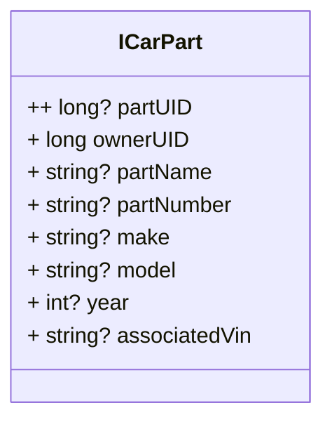

#### Part Listing
- For DB implementation: 
  - `part` would be stored as `partUID` as FK, rather than carPart object
  - `part` is PK, so no part can have two listings
    - This is so we cannot have two listings for same part
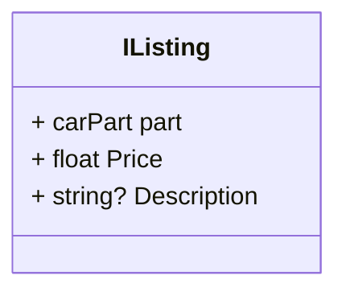
#### Search Parameters
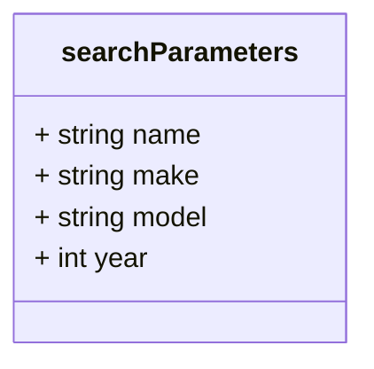
#### Buy Request
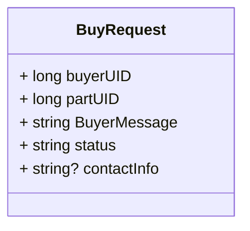

#### Contact Info

## Site Map
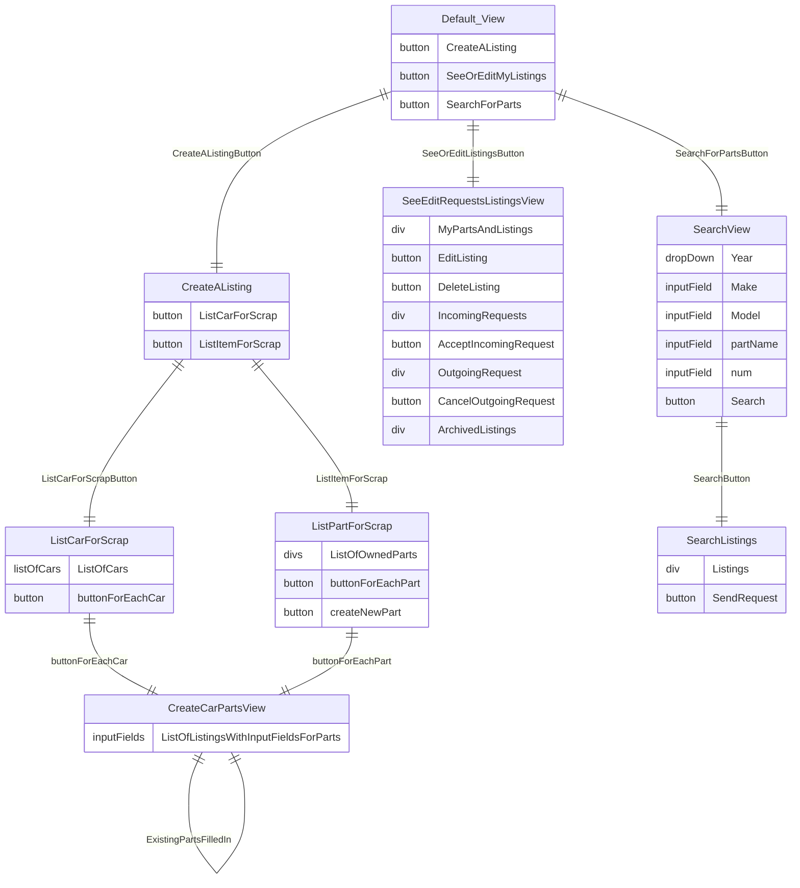

## SYC-1
#### User Story: As an authenticated user, I am able to list a car as scrap, which should automatically list supported items.

### Pass Requirements
- Vehicle is listed on the market place
- Vehicle profile Status is changed to "parts for sale"
- The supported parts will be listed for sale:
  - Engine
  - Transmission
  - Catalytic Converter
  - Wheels and Tires
  - Car Seats
  - Front and Rear Bumpers
  - Doors
  - Airbags
  - Tailgates (From trucks) or Trunk Lids (from cars)
  - Headlight/Taillight housings
  - Radio/Infotainment system
- User is able to recieve offers for parts
- Log is generated

### Fail Requirements
- Vehicle is not listed (Log, Server, Error, "Failed to list vehicle profile")
- Vehicle takes longer than 3 seconds to list (Log, Server, Warning, "Took longer than 3 seconds to list vehicle")
- Vehicle Profile Status is not changed (Log, View, Error, "Vehicle profile status failed to change")
- Wrong Vehicle Part is listed for sale (Log, Data, Error, "User Chose the wrong part")
- No Vehicle Part is listed for sale (Log, Server, Error, "Failed to list part")

### Target Implementation
#### IPartsTarget
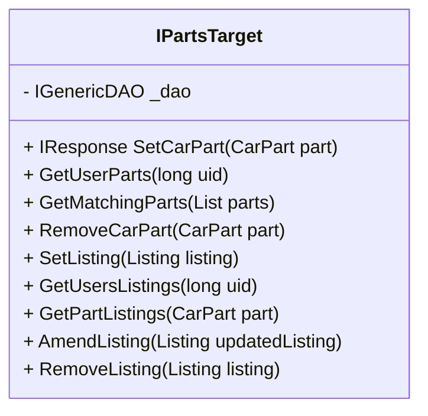

#### (Target) SetCarPart()
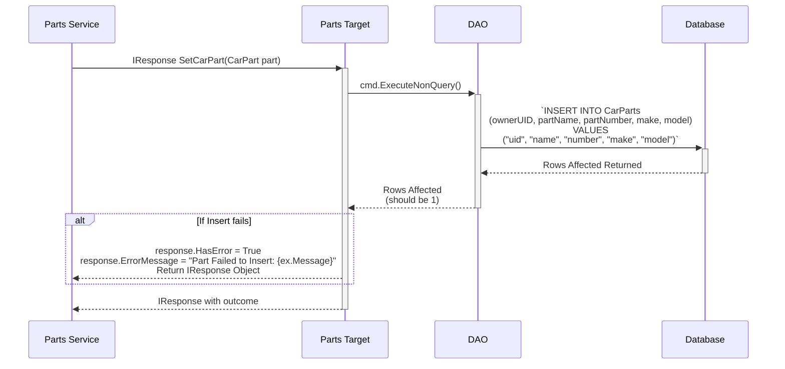

#### (Target) GetUserParts
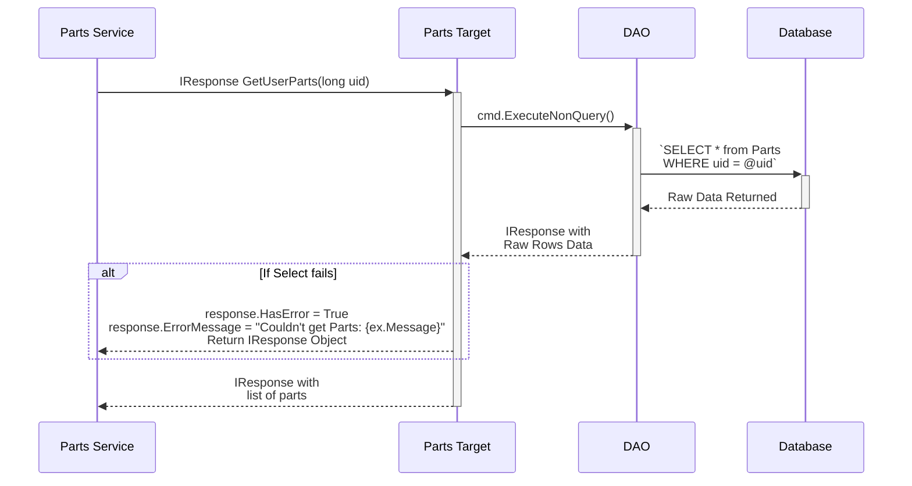

#### (Target) GetMatchingParts
- note: the purpose of this is to get the PartID from the database for other service layer methods
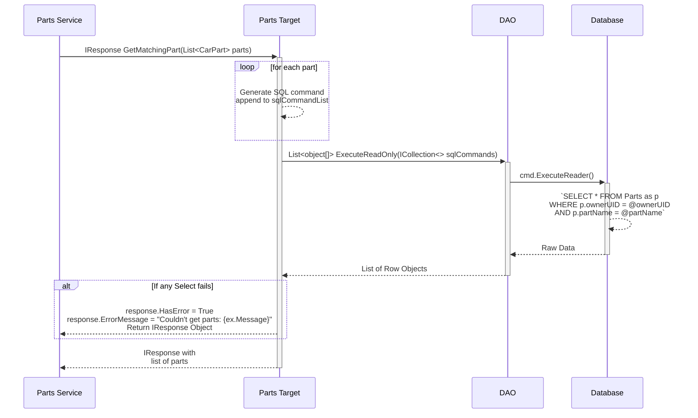

#### (Target) RemoveCarPart
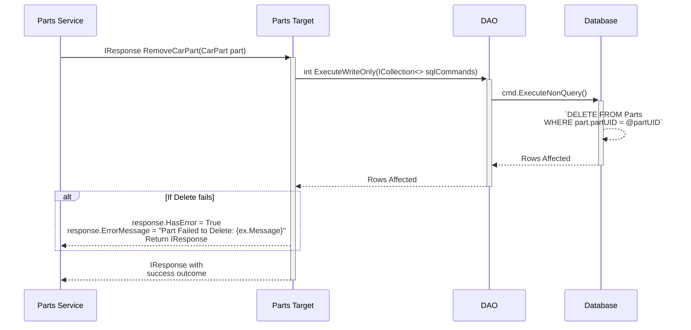

#### (Target) SetListing
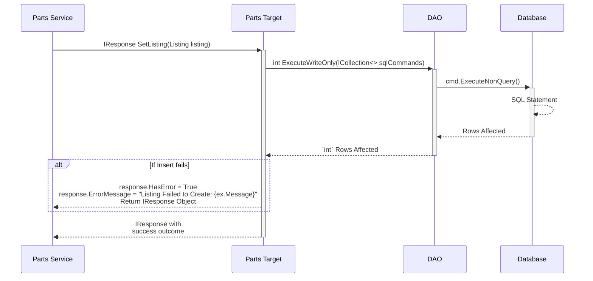
#### (Target) GetUsersListings

#### (Target) GetPartListings
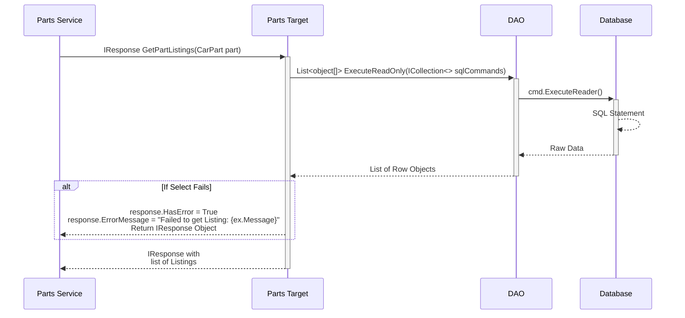

#### (Target) AmendListing
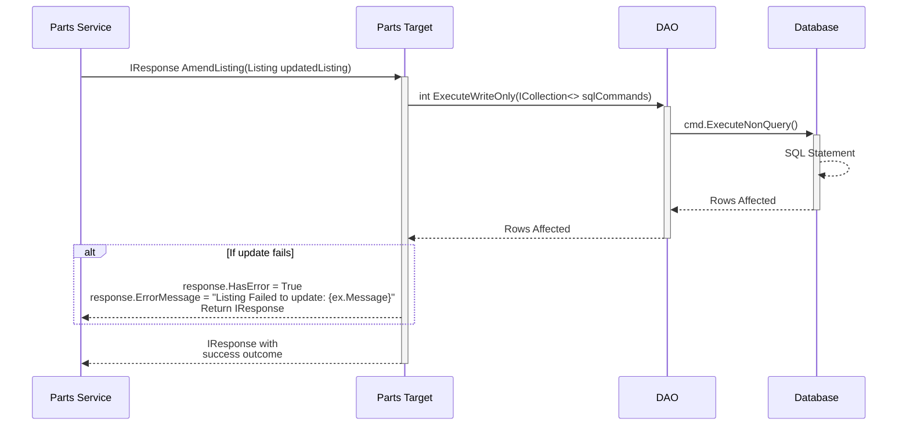
#### (Target) RemoveListing
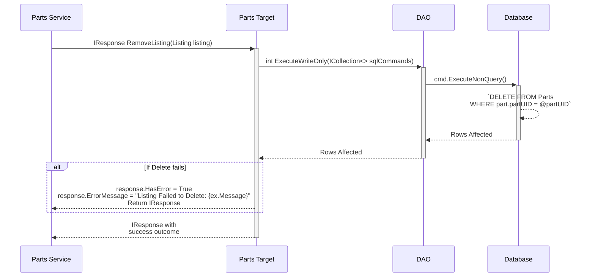
### Service Implementation
#### IPartsService
- IPartsService
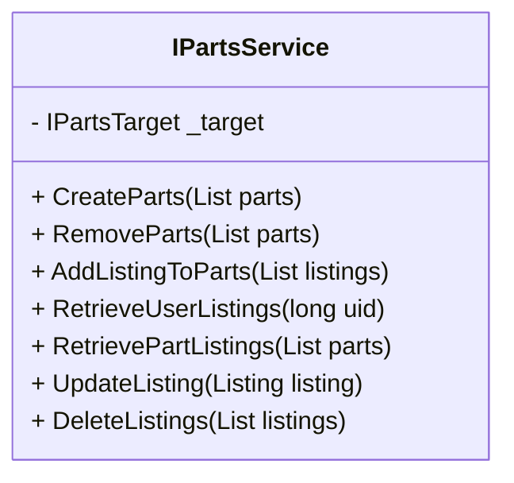

#### (Service) CreateParts
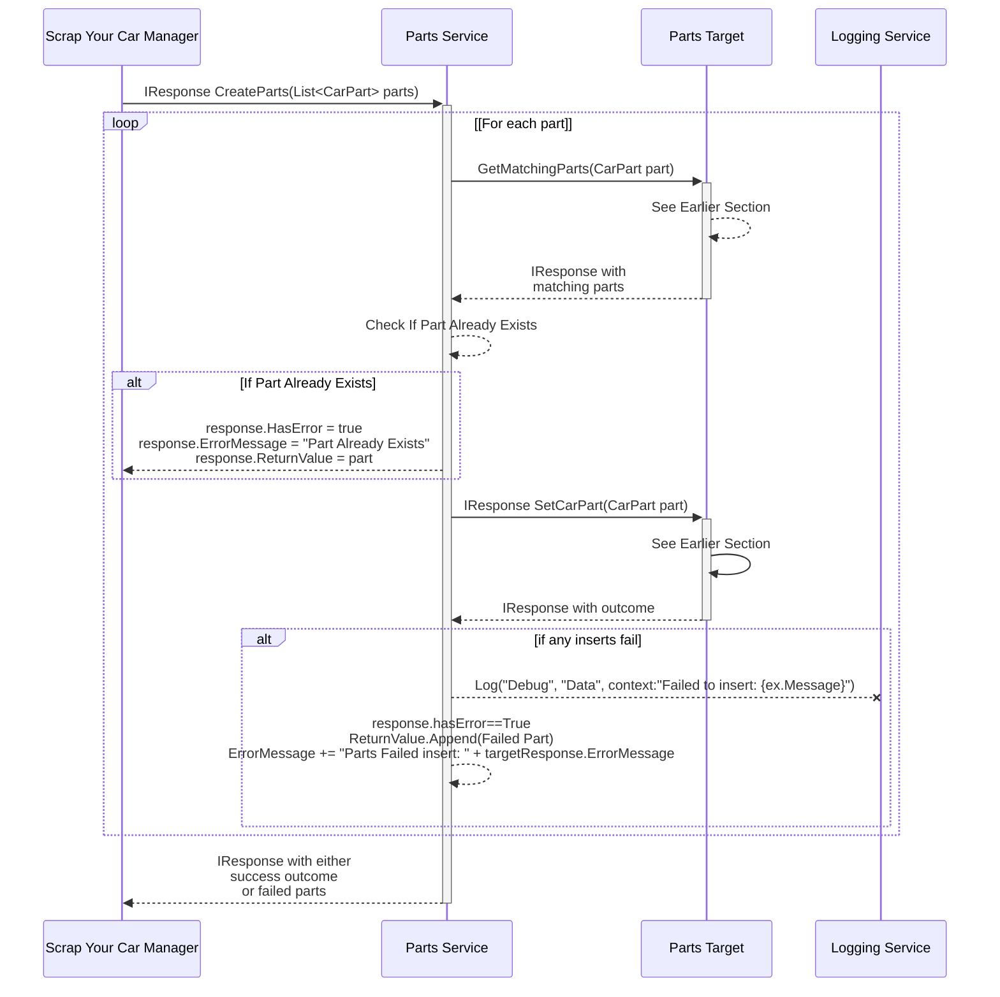

#### (Service) RemoveParts
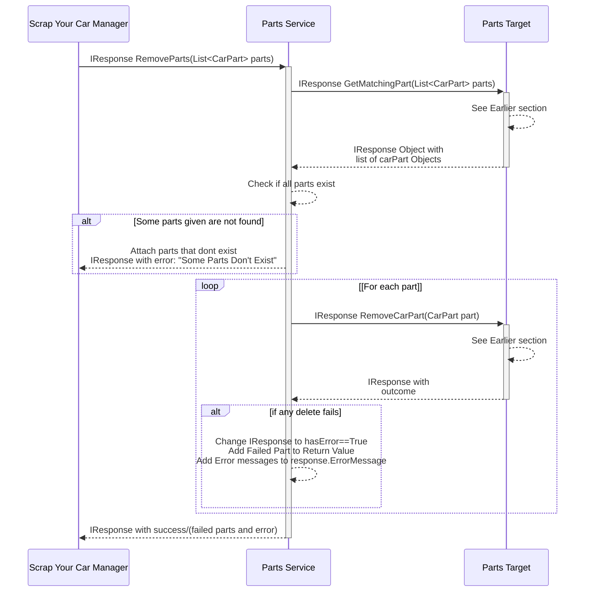

#### (Service) AddListingToParts
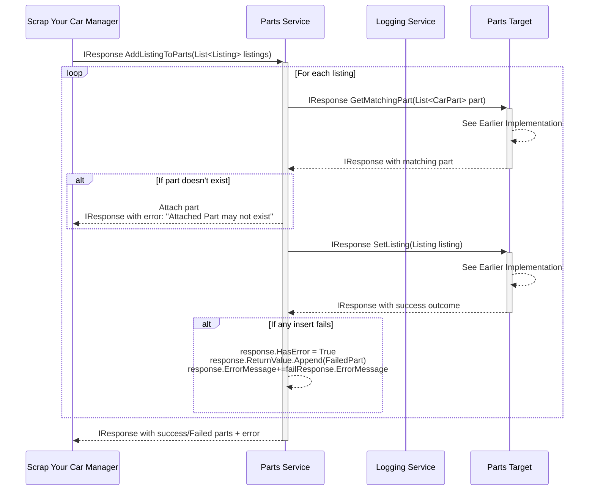
#### (Service) RetrieveUserListings
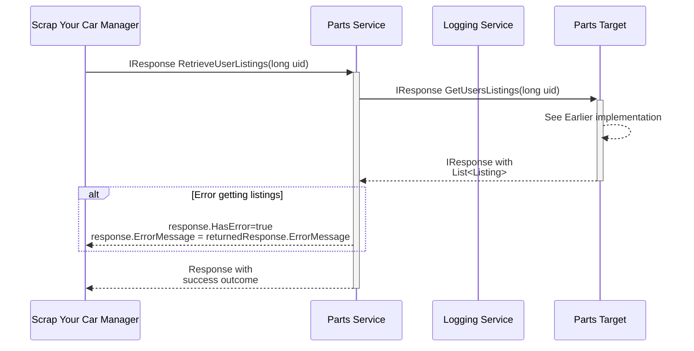
#### (Service) RetrievePartListings
```mermaid
sequenceDiagram
participant pm as Scrap Your Car Manager
participant ps as Parts Service
participant ls as Logging Service
participant pt as Parts Target

pm->>+ps: IResponse RetrievePartListings(List<CarPart> parts)
ps->>+pt: IResponse GetPartListings(CarPart part)
pt-->>pt: See Earlier implementation
pt-->>-ps: IResponse with<br>List<Listing>
alt Error getting listings
  ps-->>pm: response.HasError=true<br>response.ErrorMessage = returnedResponse.ErrorMessage
end
ps-->>-pm: IResponse with<br>success outcome
```
#### (Service) UpdateListing
```mermaid
sequenceDiagram
participant pm as Scrap Your Car Manager
participant ps as Parts Service
participant ls as Logging Service
participant pt as Parts Target

pm->>+ps: IResponse UpdateListing(Listing listing)

ps->>+pt: IResponse GetPartListings(CarPart part)
pt-->>pt: See Earlier Implementation
pt-->>-ps: IResponse with existing listing
alt If listing does not exist
  ps-->>pm: IResponse with error "No such listing found"
else If listing is identical to existing
  ps-->>pm: IResponse with error "Listing already exists"
end

ps->>+pt: IResponse AmendListing(Listing updatedListing)
pt-->>pt: See Earlier Implementation
pt-->>-ps: IResponse with success outcome

alt Error updating listings
  ps-->>pm: response.HasError=true<br>response.ErrorMessage = returnedResponse.ErrorMessage
end
ps-->>-pm: IResponse with<br>success outcome
```
#### (Service) DeleteListings
```mermaid
sequenceDiagram
participant pm as Scrap Your Car Manager
participant ps as Parts Service
participant ls as Logging Service
participant pt as Parts Target
participant dao as DAO
participant db as Database

pm->>+ps: IResponse DeleteListings(List<Listing> listings)

loop For each listing
  ps->>+pt: IResponse GetPartListings(CarPart part)
  pt-->>pt: See Earlier Implementation
  pt-->>-ps: IResponse with existing listing
  alt If listing does not exist
    ps-->>pm: IResponse with error "No such listing found"
  end
  ps->>+pt: IResponse RemoveListing(Listing listing)
  pt-->>-ps: IResponse with<br>success outcome

  alt Error deleting listing
    ps-->>pm: response.HasError=True<br>response.ErrorMessage += returnedResponse.ErrorMessage<br>response.ReturnValue+= Failed Part
  end
end
ps-->>-pm: IResponse withs<br>uccess/Failed Parts
```
### IScrapYourCarManager + End Points
#### IScrapYourCarManager Interface
```mermaid
classDiagram
class IScrapYourCarManager{
  - IPartsService _pService
  - IBuyRequestService _bService
  - IListingSearchService _sService
  + GenerateDefaultParts(string vin)
  + GeneratePart(ICarPart part)
  + GenerateListings(List<IListing> listings)
  + EditListing(IListing listing)
  + GetUserListings(long uid)
  + GetUserParts(long uid)
  
  + SearchParts(SearchParameters SearchBy)

  + CreateBuyRequest(BuyRequest request)
  + GetIncomingBuyRequests(BuyRequest request)
  + GetOutgoingBuyRequests(BuyRequest request)
  + ApproveBuyRequest(BuyRequest request)
  + DenyBuyRequest(BuyRequest request)
  + DeleteBuyRequest(BuyRequest request)
}

```
#### (Manager + End Point) Create Default Parts
- Note: the goal of this function is to create a list of parts to send to the front end
```mermaid
sequenceDiagram
participant fe as Front End Script
participant ep as End Point
participant pm as Scrap Your Car Manager
participant ps as Parts Service
participant ls as Logging Service

fe->>+ep: ip:port/parts/PostScrapCarParts (body: vinNumber)
ep->>+pm: IResponse GenerateDefaultParts(string vin)

pm--xls: Log(Server, Info, "Creating Default Parts", userHash)

pm->>+ps: IResponse CreateParts(List<CarPart> parts)
ps-->>ps: See Earlier implementation
ps-->>-pm: IResponse with<br>success outcome
alt Parts failed to generate
  pm--xls: Log(Server, Error, "Failed to create parts, userHash)
  pm-->>ep: IResponse with list of failed parts
  ep-->>fe: HTTP 500, "Could not list some parts", list of parts that could not be generated
end
pm--xls: Log(Server, Info, "Default Parts Created", userHash)
pm-->>-ep: IResponse with success outcome
ep-->>-fe: HTTP 200 with List of Part Objects
```

#### (Manager + End Point) Create Listings
- Note: Can be used for one or many listings
```mermaid
sequenceDiagram
participant fe as Front End Script
participant ep as End Point
participant pm as Scrap Your Car Manager
participant ps as Parts Service
participant ls as Logging Service

fe->>+ep: ip:port/parts/PostScrapCarListings (body: jsonArray listing[])
ep->>+pm: IResponse GenerateListings(List<IListing> listings)

pm--xls: Log(Server, Info, "Creating Listings", userHash)

pm->>+ps: IResponse AddListingToParts(List<Listing> listings)
ps-->>ps: See Earlier Implementation

alt Listings failed to generate
  pm--xls: Log(Server, Error, "Failed to create listings, userHash)
  pm-->>ep: IResponse with list of failed parts
  ep-->>fe: HTTP 500, "Could not list some Listings", list of parts that could not be generated
else Listing already Exists
  pm--xls: Log(Server, Warning, "Listing is same as existing", userHash)
  pm-->>ep: response.HasError = True<br>response.ErrorMessage = returnedResponse.ErrorMessage
  ep-->>fe: HTTP Status Code 409(Conflict), "Listing already exists, no changes made"
end

ps-->>-pm: IResponse with success outcome

pm--xls: Log(Server, Info, "Listings Created", userHash)

pm-->>-ep: IResponse with<br>success outcome
ep-->>-fe: HTTP 200, "All listings generated successfully"
```

#### (Manager + End Point) Edit Listing
```mermaid
sequenceDiagram
participant fe as Front End Script
participant ep as End Point
participant pm as Scrap Your Car Manager
participant ps as Parts Service
participant ls as Logging Service

fe->>+ep: ip:port/parts/PostEditListing (body: Listing)
ep->>+pm: IResponse EditListing(IListing listing)
pm--xls: Log(Server, Info, "Updating Listing", userHash)
pm->>+ps: IResponse UpdateListing(Listing listing)
ps-->>ps: See Earlier Implementation
ps-->>-pm: IResponse with<br>success outcome
alt Listing does not exist
  pm--xls: Log(Server, Warning, "Tried to edit listing that doesn't exist", userHash)
  pm-->>ep: HTTP Status Code 400(Bad Request), "Listing does not exist" 
else Listing is identical to existing
  pm--xls: Log(Server, Warning, "Updated Listing is same as existing", userHash)
  pm-->>ep: HTTP Status Code 409(Conflict), "Listing already exists, no changes made"
else Listing could not be updated
  pm--xls: Log(Server, Error, "Failed to Edit listings", userHash)
  pm-->>ep: HTTP Status Code 500, "Error updating listing"
end
pm--xls: Log(Server, Info, "Listing Successfully updated", userHash)
pm-->>-ep: IResponse with<br>success outcome
ep-->>-fe: HTTP 200, "Listing Successfully Updated"
```

#### (Front End) Place Parts For Scrap
```mermaid
sequenceDiagram
participant u as User
participant v as Front End View
participant fe as Front End Script
participant ep as End Point

v-->>v: List a Car Part View
u-->>v: User Fills out Listing for<br>part, then clicks button
v->>+fe: createPartListing(Listing listing)


fe->>+ep: ip:port/parts/PostParts (ICarPart part)
ep-->>ep: View Earlier implementation
ep-->>-fe: HTTP 200, "All Parts generated successfully"

alt If 409 is returned
  fe-->>fe: Continue
else If 500 is returned
  fe-->>v: Return alert, notifying user part upload failed<br>Loads Default View
end

fe->>+ep: ip:port/parts/PostScrapCarListings (body: jsonArray listing[])
ep-->>ep: See Earlier Implementation
ep-->>-fe: HTTP 200, "All listings generated successfully"

fe-->>-v: Loads Default View
```

## SYC-3
### User Story: As an Authenticated User I am able to list individual spare parts, that are not attached to vehicles, for sale
### Pass Requirements
- Part is listed within 3 seconds
- Users are able to receive offers for their part 3 seconds after it is listed
- Pictures must be uploaded to the intended target vehicle part
- Users are not able to accept offers for parts with no uploaded pictures
- Log will be generated after operation successfully uploaded the part: 
  - Log Level: Info
  - Category: Business
  - Description: Vehicle’s part post is visible on the marketplace, vehicle’s part profile information of the post is logged and the information of the account that posted it

### Fail Requirements
- Vehicle Part is not listed on the marketplace
  - A log will be generated
    - Log Level: Error
    - Category: Server
    - Description: Part not listed on marketplace
- Vehicle part takes longer than 3 seconds to be listed
  - A Log will be generated
    - Log Level: Warning
    - Category: Business
    - Description: listing took longer than 3 seconds

### Target Implementation
- No Target Changes needed

### Service Implementation
- No Service Changes needed

### Manager + End Point + Front End

#### (Manager + End Point) Create Individual Part
- Note: the goal of this function is to create a list of parts to send to the front end
```mermaid
sequenceDiagram
participant fe as Front End Script
participant ep as End Point
participant pm as Scrap Your Car Manager
participant ps as Parts Service
participant ls as Logging Service

fe->>+ep: ip:port/parts/PostParts (ICarPart part)
ep->>+pm: IResponse GenerateParts(ICarPart part)

pm--xls: Log(Server, Info, "Creating Parts", userHash)

pm->>+ps: IResponse CreateParts(List<ICarPart> parts)
ps-->>ps: See Earlier implementation
ps-->>-pm: IResponse with<br>success outcome
alt Part is identical to existing
  pm--xls: Log(Server, Warning, "Part is same as existing", userHash)
  pm-->>ep: response.HasError = True<br>response.ErrorMessage = returnedResponse.ErrorMessage
  ep-->>fe: HTTP Status Code 409(Conflict), "Part already exists, no changes made"
else Parts failed to generate
  pm--xls: Log(Server, Error, "Failed to create parts, userHash)
  pm-->>ep: IResponse with list of failed parts
  ep-->>fe: HTTP 500, "Could not list some parts", list of parts that could not be generated
end 
pm--xls: Log(Business, Info, "Default Parts Created", userHash)
pm-->>-ep: IResponse with success outcome
ep-->>-fe: HTTP 200, "All Parts generated successfully"
```

#### (Manager + End Point) Create Individual Part listings
- Note: This is the same implementation as earlier
```mermaid
sequenceDiagram
participant fe as Front End Script
participant ep as End Point
participant pm as Scrap Your Car Manager
participant ps as Parts Service

fe->>+ep: ip:port/parts/PostScrapCarListings (body: jsonArray listing[])
ep->>+pm: IResponse GenerateListings(List<IListing> listings)

pm--xls: Log(Server, Info, "Creating Listings", userHash)

pm->>+ps: IResponse AddListingToParts(List<Listing> listings)
ps-->>ps: See Earlier Implementation

alt Listings failed to generate
  ps-->>pm: IResponse with error outcome
  pm--xls: Log(Server, Error, "Failed to create listings, userHash)
  pm-->>ep: IResponse with list of failed parts
  ep-->>fe: HTTP 500, "Could not list some Listings", list of parts that could not be generated
end

ps-->>-pm: IResponse with success outcome

pm--xls: Log(Business, Info, "Listings Created", userHash)

pm-->>-ep: IResponse with<br>success outcome
ep-->>-fe: HTTP 200, "All listings generated successfully"
```

#### (Front End) Create Individual Part Listings
```mermaid
sequenceDiagram
participant u as User
participant v as Front End View
participant fe as Front End Script
participant ep as End Point

v-->>v: List a Car Part View 
u-->>v: User Fills out Listing for<br>part, then clicks button
v->>+fe: createPartListing(Listing listing)

fe->>+ep: ip:port/parts/PostParts (ICarPart part)
ep-->>ep: View Earlier implementation
ep-->>-fe: HTTP 200, "All Parts generated successfully"

alt If 409 is returned
  fe-->>fe: Continue
else If 500 is returned
  fe-->>v: Return alert, notifying user part upload failed<br>Loads Default View
end

fe->>+ep: ip:port/parts/PostScrapCarListings (body: jsonArray listing[])
ep-->>ep: See Earlier Implementation
ep-->>-fe: HTTP 200, "All listings generated successfully"

fe-->>-v: Alerts user that<br>listings were created successfully.<br>Loads Default View
```

## SYC-4
### User Story: As any user, I can search for vehicle parts by entering the type of part, or vehicle year/make/model. By default it is sorted by price (ascending)
### Pass Requirements
- Results of vehicles are sorted based on user’s selected attribute or the default
- No results show if there are no vehicles with the user’s selected attributes
- Asks the user to search again with different attributes if no results show
- User enter valid input to the search function 
  - Results of vehicles’ parts that match the user’s specifications within 3 seconds
  - Results will be sorted according to price (ascending) 
  - If there are more than 10 posts on the marketplace that contain the keyword that the user provided, the application will display 10 at a time and each time the user requests to see more,  the application will load 10 more posts at a time.
  - If there are no posts on the marketplace that contain the keyword user provided, the application will display a blank marketplace page with a message about there are currently no posts.
- User does not provide any input for the search function 
  - Application will displayed a blank marketplace page with a message about user need to provide some input for the search function 
- Log will be generated after search function complete and all results are displayed  
  - Log Level: Info
  - Category: Business
  - Description: Search operation for vehicle’s part successful, keyword enter by user will also be logged
- System failures from this feature must not result in the system going offline

### Fail Requirements
- No results show even though there are vehicles that meet the searched criteria
  - Application should not go offline  
  - Log will be generated: 
    - Log Level: Error
    - Category:View
    - Description: No result show even though there are available options that fit criteria 
- Private vehicles are shown
  - Application should not go offline  
  - Log will be generated: 
    - Log Level: Error
    - Category: View
    - Description: System failure unrecoverable
- Results are shown after 3 seconds
  - Application should not go offline  
  - Log will be generated: 
    - Log Level: Warning
    - Category: Server
    - Description: Took longer than 3 seconds to  show results

### Target Implementation
- IListingSearchTarget
```mermaid
classDiagram
class IListingSearchTarget{
  - IGenericDAO _dao
  + GetListingsBySearch(SearchParameters searchBy)
}
```
#### (Target) GetPartsBySearch
```mermaid
sequenceDiagram
participant ps as Parts Service
participant pt as Listing Search Target
participant dao as DAO
participant db as Database

ps->>+pt: IResponse GetListingsBySearch(SearchParameters searchBy)
pt->>+dao: List<object[]> ExecuteReadOnly(ICollection<> sqlCommands)
dao->>+db: cmd.ExecuteReader()
db-->>db: SQL Statement
db-->>-dao: Raw Data
dao-->>-pt: List of Row Objects
alt If Select Fails
  pt-->>ps: response.HasError = True<br> response.ErrorMessage = "Failed to get Listing: {ex.Message}"<br>Return IResponse Object
end
pt-->>-ps: IResponse with<br>list of Listings
```

### Service Implementation
- IListingsSearchService
```mermaid
classDiagram
class IListingSearchService{
  - IListingSearchTarget _target
  + RetrieveListingsBySearch(SearchParameters searchBy)
}
```

#### (Service) RetrievePartsBySearch
```mermaid
sequenceDiagram
participant pm as Scrap Your Car Manager
participant ps as Parts Service
participant pt as Parts Target

pm->>+ps: IResponse RetrieveListingsBySearch(SearchParameters searchBy)
ps->>+pt: IResponse GetListingsBySearch(SearchParameters searchBy)
pt-->>pt: See Earlier Section
pt-->>-ps: IResponse with<br>list of Listings
alt If Error Returned
  ps-->>pm: response.HasError = True<br>response.ErrorMessage = returnedResponse.ErrorMessage
end
ps-->>-pm: IResponse with<br>list of Listings
```

### Manager + End Point
#### (Manager + End Point) SearchParts
```mermaid
sequenceDiagram
participant fe as Front End Script
participant ep as End Point
participant pm as Scrap Your Car Manager
participant ps as Search Service

fe->>+ep: ip:port/parts/PostFindParts<br>(body: SearchParameters)
ep->>+pm: IResponse SearchParts(SearchParameters SearchBy)
pm->>+ps: IResponse RetrieveListingsBySearch(SearchParameters SearchBy)
ps-->>ps: See Earlier Section
ps-->>-pm: IResponse with<br>List of Listings
alt If Error Returned
  pm-->>ep: response.HasError = True<br>response.ErrorMessage = returnedResponse.ErrorMessage
  ep-->>fe: HTTP 500, Database Search Failed
end
pm->>pm: Sort List by price
pm-->>-ep: IResponse with<br>List of Listings
ep-->>-fe: HTTP 200, List of Listings
```

### Front End
#### (Front End) Search and Display
```mermaid
sequenceDiagram
participant v as Front End View
participant fe as Front End Script
participant ep as End Point

v->>+fe: searchListings(): Gets Data from DOM
fe->>+ep: ip:port/parts/PostFindParts<br>(body: SearchParameters)
alt HTTP 500
  ep-->>fe: HTTP 500, List of Listings
  fe-->>v: Alert view of failure<br>Do Not Change View
end
ep-->>-fe: HTTP 200, List of Listings
fe-->>-v: Updates view with list of Listings Returned
```

## SYC-5
### User Story: As an authenticated user, I can request to buy a vehicle part I searched for and retrieve contact information of the seller after they accept the request 
### Pass Requirements
- Request is sent to the seller within 3 seconds
  - Log will be generated: 
    - Log Level: Info
    - Category: Business
    - Description: Buy part request operation successfully sent 

### Fail Requirements
- Request is not sent within 3 seconds
  - Application should not go offline  
  - Log will be generated: 
    - Log Level: Warning
    - Category: Business
    - Description: Took longer than 3 seconds

### Target Implementation
#### IBuyTarget Interface
```mermaid
classDiagram
class IBuyTarget{
  - IGenericDAO _dao
  + SetBuyRequest(BuyRequest request)
  + GetSentBuyRequests(long uid)
  + GetToMeBuyRequests(Long uid)
  + GetMatchingBuyRequest(BuyRequest request)
  + UpdateBuyRequest(BuyRequest request)
  + RemoveBuyRequest(BuyRequest request)
}
```

#### (Target) SetBuyRequest
```mermaid
sequenceDiagram
participant ps as Parts Service
participant ls as Logging Service
participant pt as Parts Target
participant dao as DAO
participant db as Database

ps->>+pt: IResponse SetBuyRequest(BuyRequest request)
pt->>+dao: int ExecuteWriteOnly(ICollection<> sqlCommands)
dao->>+db: cmd.ExecuteNonQuery()
db-->>db: SQL Commands
db-->>-dao: Raw Rows Affected
dao-->>-pt: int Rows affected
alt If Insert Fails
  pt-->>ps: response.HasError=True<br>response.ErrorMessage = ex.Message<br>Return IResponse
end
pt-->>-ps: IResponse with<br>success outcome
```

#### (Target) GetSentBuyRequests
```mermaid
sequenceDiagram
participant ps as Parts Service
participant ls as Logging Service
participant pt as Parts Target
participant dao as DAO
participant db as Database

ps->>+pt: IResponse GetSentBuyRequests(long uid)
pt->>+dao: List<object[]> ExecuteReadOnly(ICollection<> sqlCommands)
dao->>+db: cmd.ExecuteReader()
db-->>db: Sql Statement
db-->>-dao: Raw Data
dao-->>-pt: List of Row Objects
alt If Select Fails
  pt-->>ps: response.HasError = True<br> response.ErrorMessage = "Failed to get Requests: {ex.Message}"<br>Return IResponse Object
end
pt-->>-ps: IResponse with<br>List<IBuyRequest>
```

#### (Target) GetToMeBuyRequests
```mermaid
sequenceDiagram
participant ps as Parts Service
participant ls as Logging Service
participant pt as Parts Target
participant dao as DAO
participant db as Database

ps->>+pt: IResponse GetToMeBuyRequests(long uid)
pt->>+dao: List<object[]> ExecuteReadOnly(ICollection<> sqlCommands)
dao->>+db: cmd.ExecuteReader()
db-->>db: Sql Statement
db-->>-dao: Raw Data
dao-->>-pt: List of Row Objects
alt If Select Fails
  pt-->>ps: response.HasError = True<br> response.ErrorMessage = "Failed to get Requests: {ex.Message}"<br>Return IResponse Object
end
pt-->>-ps: IResponse with<br>List<IBuyRequest>
```

#### (Target) GetMatchingBuyRequest
```mermaid
sequenceDiagram
participant ps as Parts Service
participant ls as Logging Service
participant pt as Parts Target
participant dao as DAO
participant db as Database

ps->>+pt: IResponse GetMatchingBuyRequest(BuyRequest request)
pt->>+dao: List<object[]> ExecuteReadOnly(ICollection<> sqlCommands)
dao->>+db: cmd.ExecuteReader()
db-->>db: Sql Statement
db-->>-dao: Raw Data
dao-->>-pt: List of Row Objects
alt If Select Fails
  pt-->>ps: response.HasError = True<br> response.ErrorMessage = "Failed to get Request: {ex.Message}"<br>Return IResponse Object
end
pt-->>-ps: IResponse with<br>matching IResponse object
```

#### (Target) UpdateBuyRequest
```mermaid
sequenceDiagram
participant ps as Parts Service

participant pt as Parts Target
participant dao as DAO
participant db as Database
ps->>+pt: IResponse UpdateBuyRequest(BuyRequest request)
pt->>+dao: int ExecuteWriteOnly(ICollection<> sqlCommands)
dao->>+db: cmd.ExecuteNonQuery()
db-->>db: SQL Commands
db-->>-dao: Raw Rows Affected
dao-->>-pt: int Rows affected
alt If Insert Fails
  pt-->>ps: response.HasError=True<br>response.ErrorMessage = ex.Message<br>Return IResponse
end
pt-->>-ps: IResponse with<br>success outcome
```


#### (Target) RemoveBuyRequest
```mermaid
sequenceDiagram
participant ps as Parts Service
participant pt as Parts Target
participant dao as DAO
participant db as Database

ps->>+pt: IResponse RemoveBuyRequest(IBuyRequest request)
pt->>+dao: int ExecuteWriteOnly(ICollection<> sqlCommands)
dao->>+db: cmd.ExecuteNonQuery()
db-->>db: SQL Commands
db-->>-dao: Raw Rows Affected
dao-->>-pt: int Rows affected
alt If Insert Fails
  pt-->>ps: response.HasError=True<br>response.ErrorMessage = ex.Message<br>Return IResponse
end
pt-->>-ps: IResponse with<br>success outcome
```

### Service Implementation
#### (Service) IBuyService Interface
```mermaid
classDiagram
class IBuyRequestService{
  - IBuyTarget _target
  + CreateBuyRequest(BuyRequest request)
  + RetrieveIncomingBuyRequests(Long uid)
  + RetrieveOutgoingBuyRequests(long uid)
  + RetrieveMatchingBuyRequests(BuyRequest request)
  + DeleteBuyRequest(BuyRequest request)
  + ApproveBuyRequests(BuyRequest request)
  + DenyBuyRequest(BuyRequest request)
}
```
  + UpdateBuyRequest(BuyRequest request)
#### (Service) CreateBuyRequest
```mermaid
sequenceDiagram
participant pm as Scrap Your Car Manager
participant ps as Parts Service
participant pt as Parts Target

pm->>+ps: IResponse CreateBuyRequest(BuyRequest request)
ps->>+pt: IResponse SetBuyRequest(BuyRequest request)
pt-->>pt: See Earlier Section
pt-->>-ps: IResponse with<br>Success outcome
alt If Error occurred
  ps-->>pm: response.HasError = True<br>response.ErrorMessage = returnedResponse.ErrorMessage<br>return response
end
ps-->>-pm: IResponse with<br>Success outcome
```

#### (Service) RetrieveIncomingBuyRequests
```mermaid
sequenceDiagram
participant pm as Scrap Your Car Manager
participant ps as Parts Service
participant pt as Parts Target

pm->>+ps: IResponse RetrieveIncomingBuyRequests(long uid)
ps->>+pt: IResponse GetToMeBuyRequests(long uid)
pt-->>pt: See Earlier Section
pt-->>-ps: IResponse with<br>Buy Requests
alt If Error Response
  ps-->>pm: response.HasError=True<br>response.ErrorMessage=returnedResponse.ErrorMessage
end
ps-->>-pm: IResponse with<br>Buy Requests
```

#### (Service) RetrieveOutgoingBuyRequests
```mermaid
sequenceDiagram
participant pm as Scrap Your Car Manager
participant ps as Parts Service
participant pt as Parts Target

pm->>+ps: IResponse RetrieveOutgoingBuyRequests(long uid)
ps->>+pt: IResponse GetSentBuyRequests(long uid)
pt-->>pt: See Earlier Section
pt-->>-ps: IResponse with<br>Buy Requests
alt If Error Response
  ps-->>pm: response.HasError=True<br>response.ErrorMessage=returnedResponse.ErrorMessage
end
ps-->>-pm: IResponse with<br>Buy Requests
```

#### (Service) RetrieveMatchingBuyRequests
```mermaid
sequenceDiagram
participant pm as Scrap Your Car Manager
participant ps as Parts Service
participant pt as Parts Target

pm->>+ps: IResponse RetrieveMatchingBuyRequests()
ps->>+pt: IResponse GetMatchingBuyRequest(BuyRequest request)
pt-->>pt: See Earlier Section
pt-->>-ps: IResponse with<br>Buy Request
alt If Error Response
  ps-->>pm: response.HasError=True<br>response.ErrorMessage=returnedResponse.ErrorMessage
end
ps-->>-pm: IResponse with<br>Buy Request
```

#### (Service) DeleteBuyRequest
```mermaid
sequenceDiagram
participant pm as Scrap Your Car Manager
participant ps as Parts Service
participant ls as Logging Service
participant pt as Parts Target

pm->>+ps: IResponse DeleteBuyRequest(BuyRequest request)
ps->>+pt: IResponse GetMatchingBuyRequest(BuyRequest request)
pt-->>pt: See Earlier Section

pt-->>-ps: IResponse with<br>matching Request
ps-->>ps: Check to make sure request exists
alt If Request Doesn't Exist
  ps->>pm: response.HasError = True<br>response.ErrorMessage = "No Such Request Exists"<br>return response
end
ps->>+pt: IResponse RemoveBuyRequest(BuyRequest request)
pt-->>pt: See Earlier Section
pt-->>-ps: IResponse with<br>matching request
alt If Error occurred
  ps-->>pm: response.HasError = True<br>response.ErrorMessage = returnedResponse.ErrorMessage<br>return response
end
ps-->>-pm: IResponse with<br>success outcome
```

### Manager + End Point
#### (Manager + End Point) MakeBuyRequest
```mermaid
sequenceDiagram
participant fe as Front End Script
participant ep as End Point
participant pm as Scrap Your Car Manager
participant ps as Parts Service

fe->>+ep: ip:port/parts/
ep->>+pm: IResponse MakeBuyRequest(BuyRequest request)

pm->>+ps: IResponse RetrieveMatchingBuyRequest(BuyRequest)
ps-->>ps: See Earlier Section
ps-->>-pm: IResponse with<br>matching request
pm-->>pm: Check that<br>object exists

pm->>+ps: IResponse CreateBuyRequest(BuyRequest request)
ps-->>ps: See Earlier Section
ps-->>-pm: IResponse with<br>success outcome

pm-->>-ep: IResponse with<br>success outcome
ep-->>-fe: HTTP 200, Request Generated Successfully
```

#### (Manager + End Point) GetIncomingBuyRequests
```mermaid
sequenceDiagram
participant fe as Front End Script
participant ep as End Point
participant pm as Scrap Your Car Manager
participant ps as Parts Service

fe->>+ep: ip:port/parts/
ep->>+pm: IResponse GetIncomingBuyRequests(BuyRequest request)

pm->>+ps: IResponse RetrieveIncomingBuyRequests(long uid)
ps-->>ps: See Earlier Section
ps-->>-pm: IResponse with<br>List of requests

pm-->>-ep: IResponse with<br>List of requests
ep-->>-fe: HTTP 200, List Of Buy Request objects
```

#### (Manager + End Point) GetOutgoingBuyRequests
```mermaid
sequenceDiagram
participant fe as Front End Script
participant ep as End Point
participant pm as Scrap Your Car Manager
participant ps as Parts Service

fe->>+ep: ip:port/parts/
ep->>+pm: IResponse GetOutgoingBuyRequests(BuyRequest request)

pm->>+ps: IResponse RetrieveOutgoingBuyRequests(long uid)
ps-->>ps: See Earlier Section
ps-->>-pm: IResponse with<br>List of requests

pm-->>-ep: IResponse with<br>List of requests
ep-->>-fe: HTTP 200, List Of Buy Request objects
```

#### (Manager + End Point) DeleteBuyRequest
```mermaid
sequenceDiagram
participant fe as Front End Script
participant ep as End Point
participant pm as Scrap Your Car Manager
participant ps as Parts Service

fe->>+ep: ip:port/parts/
ep->>+pm: IResponse DeleteBuyRequest(BuyRequest request)

pm->>+ps: IResponse RetrieveMatchingBuyRequest(BuyRequest)
ps-->>ps: See Earlier Section
ps-->>-pm: IResponse with<br>matching request
pm-->>pm: Check that<br>object exists

pm->>+ps: IResponse DeleteBuyRequest(BuyRequest request)
ps-->>ps: See Earlier Section
ps-->>-pm: IResponse with<br>success outcome

pm-->>-ep: IResponse with<br>success outcome
ep-->>-fe: HTTP 200, "object deleted successfully"
```

## SYC-6
### User Story: As an authenticated selling user, I can receive requests sent by other users and confirm their offer
### Pass Requirements
- Action confirmation is shown within 3 seconds
- Request is confirmed and notification is sent to the other user
- Accepted requests send contact information to the other user
  - Log will be generated: 
    - Log Level: Info
    - Category: Business
    - Description: Buy part request operation successfully received 
- Denied requests do not send contact information to the other user

### Fail Requirements
- Action confirmation takes longer than 3 seconds
  - Log will be generated: 
    - Log Level: Warning
    - Category: Business
    - Description: Confirmation took longer than 3 seconds
- Request is still awaiting confirmation
  - Log will be generated: 
    - Log Level: Warning
    - Category: Server
    - Description: Waiting for confirmation from action
- Request does not send a notification to the other user
  - Log will be generated: 
    - Log Level: Error
    - Category:  Server
    - Description: Request wasn’t sent to user
- Accepted requests do not send contact information
  - Log will be generated: 
    - Log Level: Error
    - Category: Server
    - Description: Contact information not sent over
- Denied requests send contact information
  - Unrecoverable error

### Target Implementation
- No Changes Required

### Service Implementation
#### (Service) ApproveBuyRequest(BuyRequest request)
```mermaid
sequenceDiagram
participant pm as Scrap Your Car Manager
participant ps as Parts Service
participant pt as Parts Target

pm->>+ps: IResponse ApproveBuyRequest(BuyRequest request)
ps->>+pt: IResponse UpdateBuyRequest(BuyRequest request)
pt->>pt: See Earlier Implementation
pt-->>-ps: IResponse with<br>success outcome
ps-->>-pm: IResponse with<br>success outcome
```

#### (Service) DenyBuyRequest(BuyRequest request)
```mermaid
sequenceDiagram
participant pm as Scrap Your Car Manager
participant ps as Parts Service
participant pt as Parts Target

pm->>+ps: IResponse DenyBuyRequest(BuyRequest request)
ps->>+pt: IResponse UpdateBuyRequest(BuyRequest request)
pt->>pt: See Earlier Implementation
pt-->>-ps: IResponse with<br>success outcome
ps-->>-pm: IResponse with<br>success outcome
```

### Manager + End Point
#### (Manager + End Point) ApproveBuyRequest
```mermaid
sequenceDiagram
participant fe as Front End Script
participant ep as End Point
participant pm as Scrap Your Car Manager
participant ps as Parts Service

fe->>+ep: ip:port/parts/approveBuyRequest<br>(body: BuyRequest object)
ep->>+pm: IResponse ApproveBuyRequest(BuyRequest request)

pm->>+ps: IResponse RetrieveMatchingBuyRequest(BuyRequest)
ps-->>ps: See Earlier Section
ps-->>-pm: IResponse with<br>matching request
pm-->>pm: Check that<br>object exists

pm->>+ps: IResponse ApproveBuyRequest(BuyRequest request)
ps-->>ps: See Earlier Section
ps-->>-pm: IResponse with<br>success outcome
pm-->>-ep: IResponse with<br>success outcome
ep-->>-fe: HTTP 200, "Status Updated"
```

#### (Manager + End Point) DenyBuyRequest
```mermaid
sequenceDiagram
participant fe as Front End Script
participant ep as End Point
participant pm as Scrap Your Car Manager
participant ps as Parts Service

fe->>+ep: ip:port/parts/denyBuyRequest<br>(body: BuyRequest object)
ep->>+pm: IResponse DenyBuyRequest(BuyRequest request)

pm->>+ps: IResponse RetrieveMatchingBuyRequest(BuyRequest)
ps-->>ps: See Earlier Section
ps-->>-pm: IResponse with<br>matching request
pm-->>pm: Check that<br>object exists

pm->>+ps: IResponse DenyBuyRequest(BuyRequest request)
ps-->>ps: See Earlier Section
ps-->>-pm: IResponse with<br>success outcome
pm-->>-ep: IResponse with<br>success outcome
ep-->>-fe: HTTP 200, "Status Updated"
```