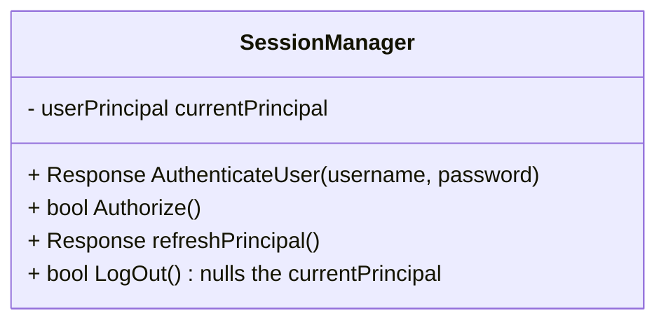
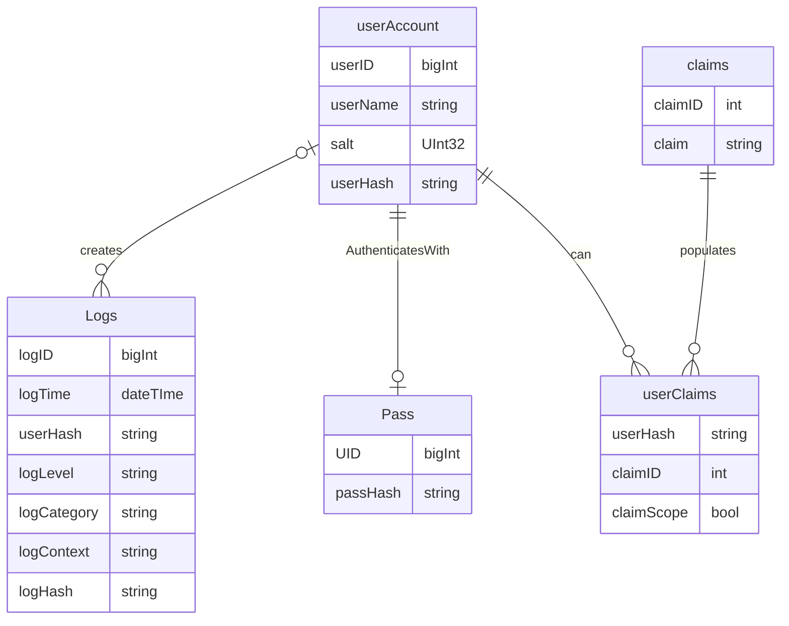
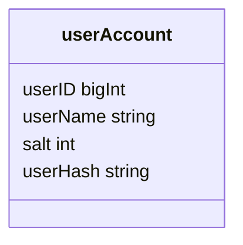
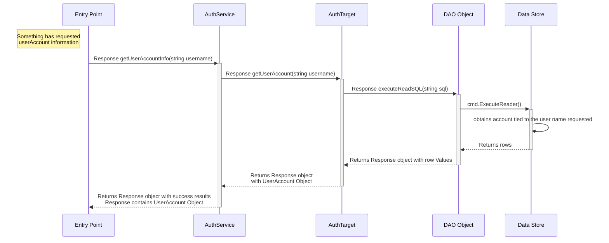
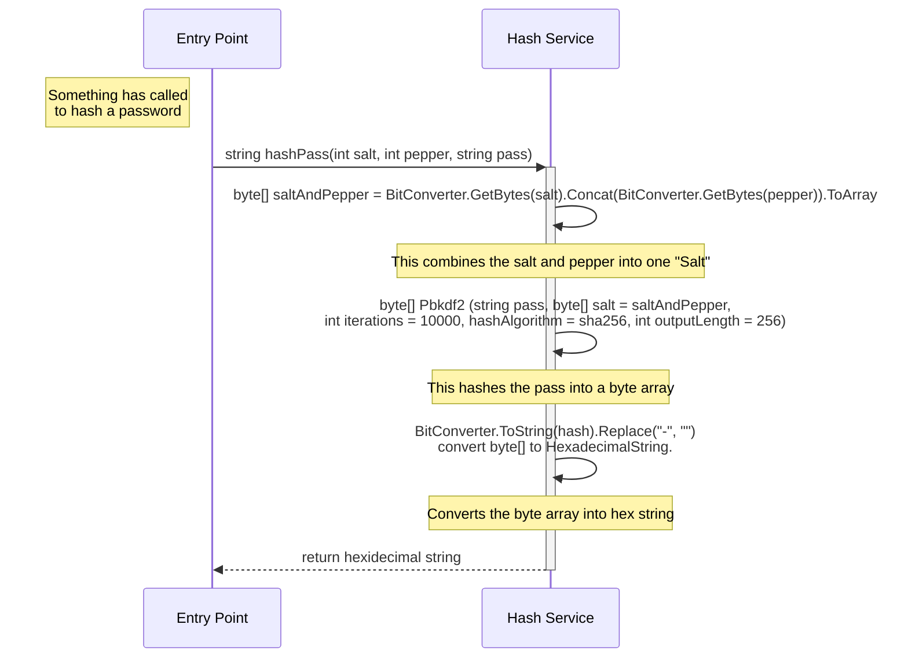
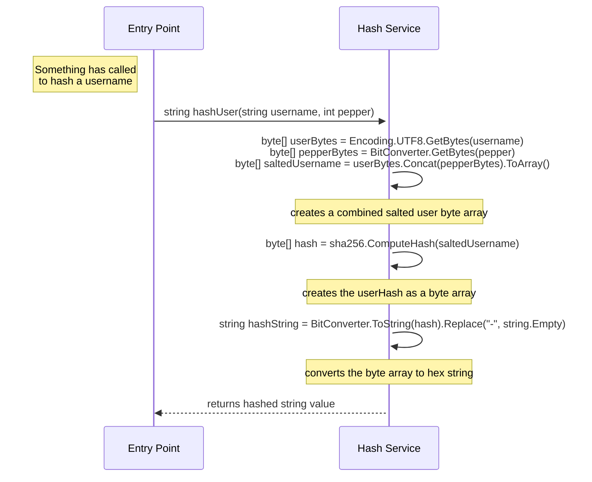
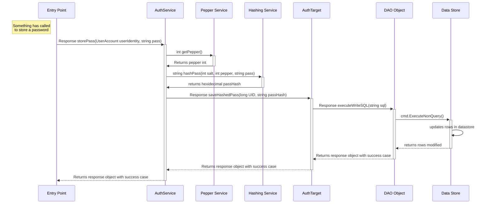
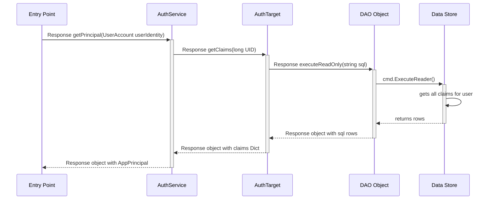
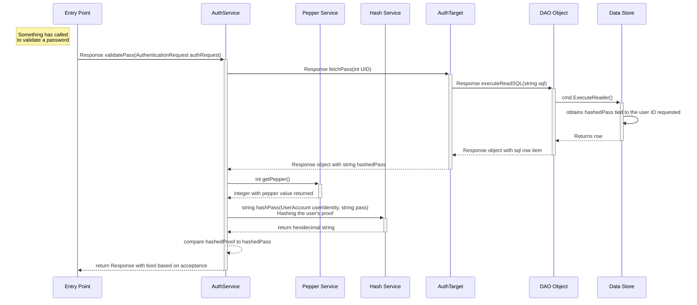
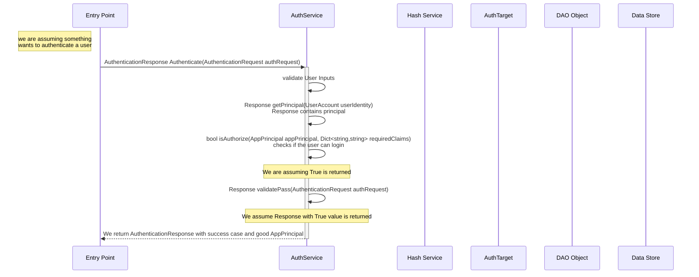

# Low Level Design Milestone 2
## Token Manager
### Main functionalities
- The goal is to create a manager that can create tokens, hold tokens, and use the tokens in order to authorize all actions. 

### Deliverables
#### Classes
- SessionManager

## Security Library For Authentication
### Main Functionalities
### Deliverables

#### Current models

### Implementation
#### Retrieve account

#### Hashing
- `string hashPass(int salt, int pepper, string pass)`

- `string hashUser(string username, int pepper)`

#### Hashing and storing a passcode

##### Retrieving User Principal

#### Validating a pass

#### Authenticating a user

