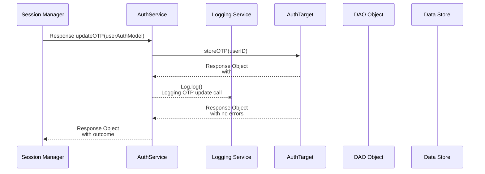
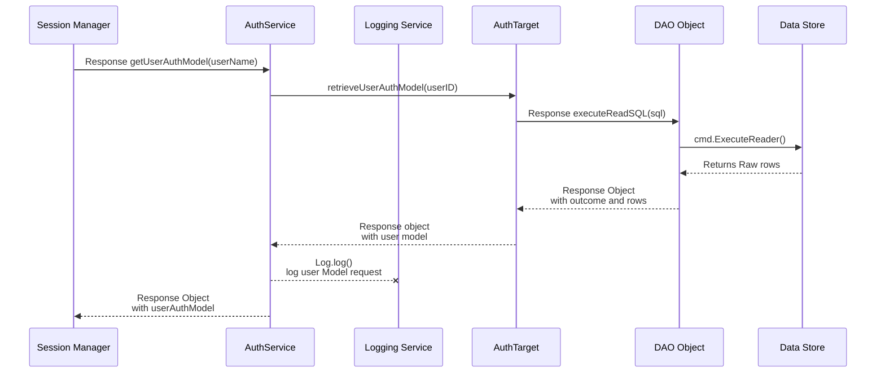
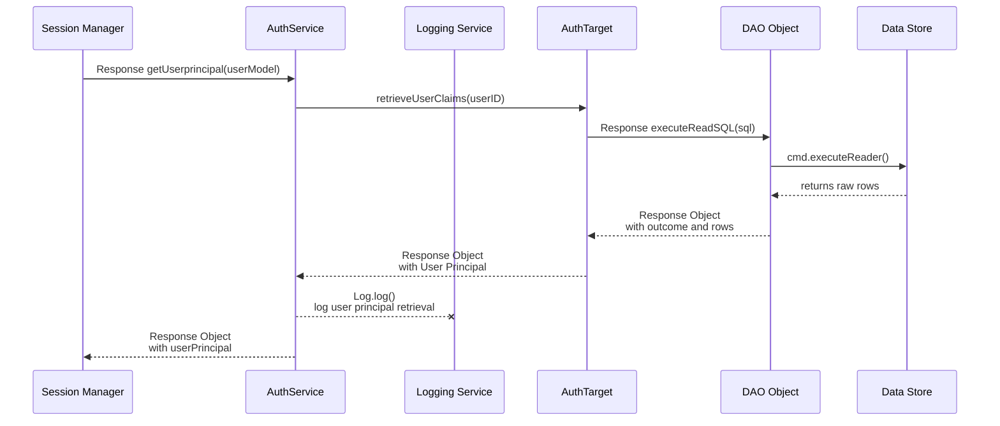
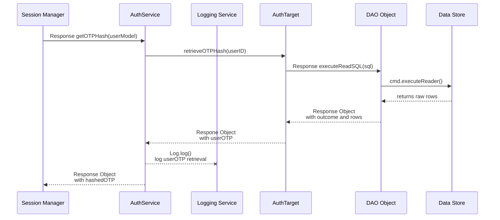
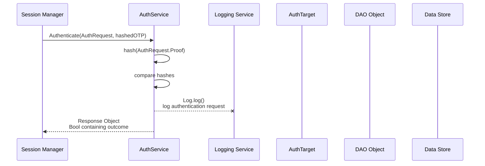
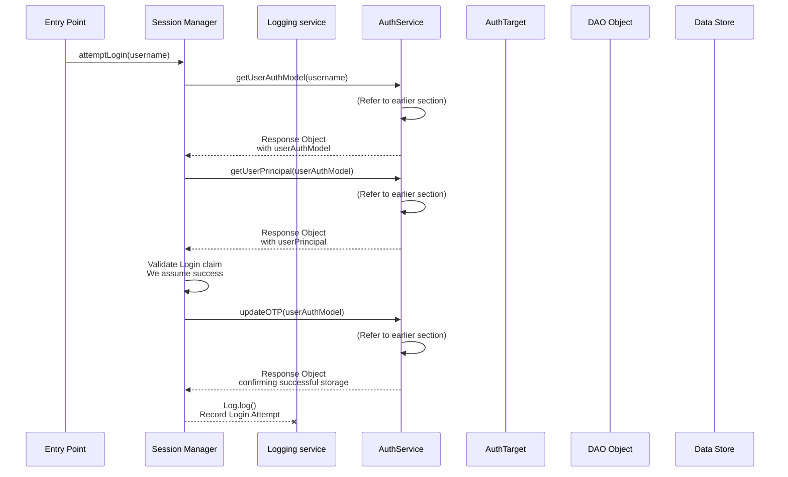
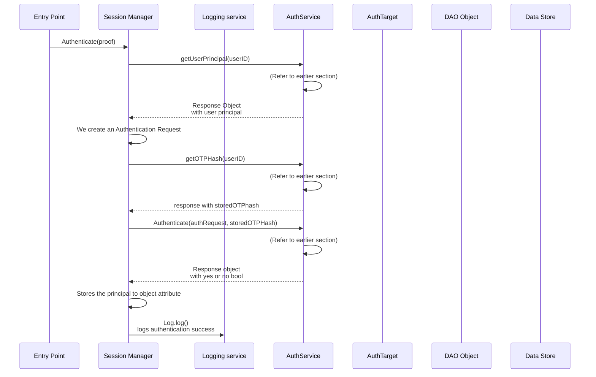
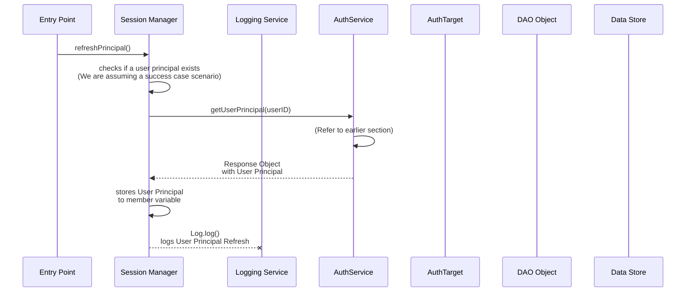
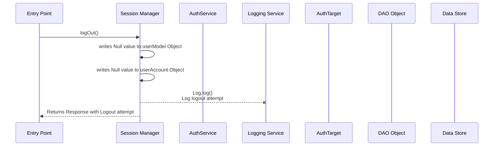
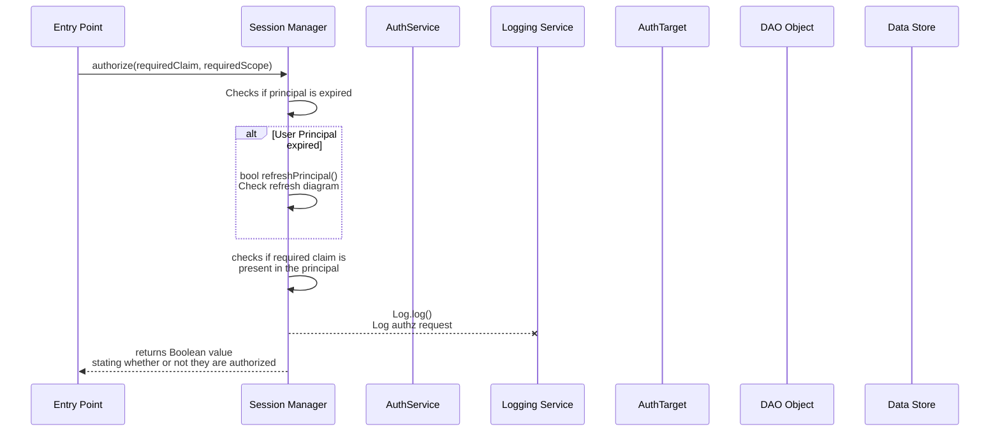

# Auth and session manager redesign
## Classes involved
- Session Manager
- Auth Service
- DB Auth Target
- AuthUserModel
- hashedOTP
- Simplified DAO functionality (for straight SQL commands)

## Services Layer
### **Set OTP passcode**
- Generates and stores an OTP to the database
- Should be called upon first login attempt, so we can start with a new OTP to work with

### **Get User model**
- Returns a model of the current user, based on their user name

### **Get user principal**
- Returns the current User principal, regardless of their login status

### **Get User OTP**
- Retrieves the hashed OTP from the database

### **Authenticate**
- Takes in a user Authentication request, and compares it to the hashed value stored in the database
- This is ran on backend as a service, to ensure items like the pepper never end up at the front end

## Manager Layer
### **Log In attempt**
- Note: this is not where we authenticate the user, this is simply what happens when we write down our username and click the "Login"
  - THis is done before we start recording log in attempts, but we will regenerate the otp the moment we click this button
- We start fresh and do the following in order:
  - Retrieves the user profile (Stores the user model to member value) 
  - Retrieves the User principal (does not store to attribute variable, simply holds it in method)
  - Checks the user principal to ensure that the user can log in
  - Goes through the full process of creating a OTP uploading it, then validating it

#### Login attempt Success case

#### Login Attempt Failure case: User does not exist
#### Login Attempt Failure case: Login claim is false

### **Authenticate User**
- Note: This must always be called after `Login Attempt` feature, or it will always fail
- Based on the locally stored user model, we are going to take a user provided OTP and  compare it to the databased stored value

#### Authenticate attempt success case: Correct OTP, successful authentication

#### Authenticate attempt failure case: No user model loaded
- Note: This case will happen if account does not exist or if they are not allowed to log in, due to Login Attempt step
#### Authenticate attempt failure case: wrong password given prior to last attempt
#### Authenticate attempt failure case: Wrong password given on last attempt
#### Authenticate attempt failure case: Max login attempts reached
- This should lock out their account for a certain period of time

### **Refresh User Principal**
- Gets an updated version of the user principal

### **Log out**
- Deletes the current principal from our system, and deletes the model and principal from our session manager object

### **Authorize**
- This is where we check if a claim is present on our userPrincipal
- We do this by passing in required claims, and validating them against the current user principal

