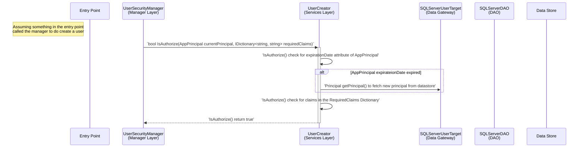

```mermaid
sequenceDiagram
participant e as Entry Point
participant usm as UserSecurityManager<br>(Manager Layer)
participant uc as UserCreator<br>(Services Layer)
participant dg as SQLServerUserTarget<br>(Data Gateway)
participant da as SQLServerDAO<br>(DAO)
participant ds as Data Store

Note Left of e: Assuming something in the entry point<br>called the manager to do create a user

usm->>+uc: `bool IsAuthorize(AppPrincipal currentPrincipal, IDictionary<string, string> requiredClaims)`
uc->>uc:'IsAuthorize() check for expirationDate attribute of AppPrincipal'
alt AppPrincipal expirateionDate expired 
    uc->>dg: 'Principal getPrincipal() to fetch new principal from datastore'
end 
uc->>uc:'IsAuthorize() check for claims in the RequiredClaims Dictionary'

uc-->>-usm: 'IsAuthorize() return true'
```