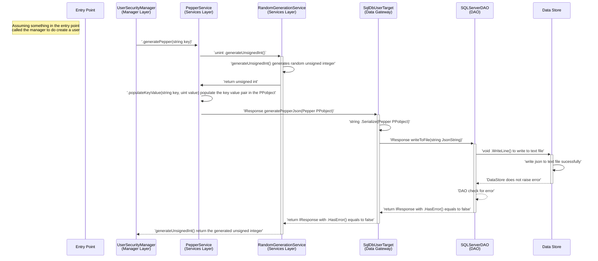

```mermaid
sequenceDiagram
participant e as Entry Point
participant usm as UserSecurityManager<br>(Manager Layer)
participant pp as PepperService<br>(Services Layer)
participant uc as RandomGenerationService<br>(Services Layer)
participant dg as SqlDbUserTarget<br>(Data Gateway)
participant da as SQLServerDAO<br>(DAO)
participant ds as Data Store

Note Left of e: Assuming something in the entry point<br>called the manager to do create a user

usm->>+pp: '.generatePepper(string key)'
pp->>+uc: `unint .generateUnsignedInt()`
uc->>uc:'generateUnsignedInt() generates random unsigned integer'
uc->>+pp: 'return unsigned int'
pp->>pp: '.populateKeyValue(string key, uint value) populate the key value pair in the PPobject'
pp->>+dg:'IResponse generatePepperJson(Pepper PPobject)' 
dg->>dg: 'string .Serialize(Pepper PPobject)'
dg->>+da: 'IResponse writeToFile(string JsonString)'
da->>+ds: 'void .WriteLine() to write to text file'
ds->>ds: 'write json to text file sucessfully'
ds-->>-da: 'DataStore does not raise error'
da-->>da: 'DAO check for error'
da-->>-dg: 'return IResponse with .HasError() equals to false' 
dg-->>-uc: 'return IResponse with .HasError() equals to false'
uc-->>-usm: 'generateUnsignedInt() return the generated unsigned integer'
```