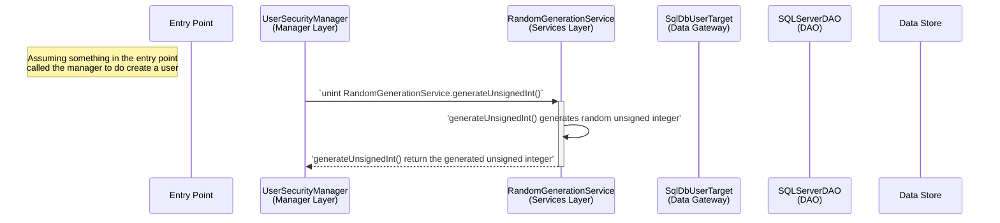

```mermaid
sequenceDiagram
participant e as Entry Point
participant usm as UserSecurityManager<br>(Manager Layer)
participant uc as RandomGenerationService<br>(Services Layer)
participant dg as SqlDbUserTarget<br>(Data Gateway)
participant da as SQLServerDAO<br>(DAO)
participant ds as Data Store

Note Left of e: Assuming something in the entry point<br>called the manager to do create a user

usm->>+uc: `unint RandomGenerationService.generateUnsignedInt()`
uc->>uc:'generateUnsignedInt() generates random unsigned integer'

uc-->>-usm: 'generateUnsignedInt() return the generated unsigned integer'
```