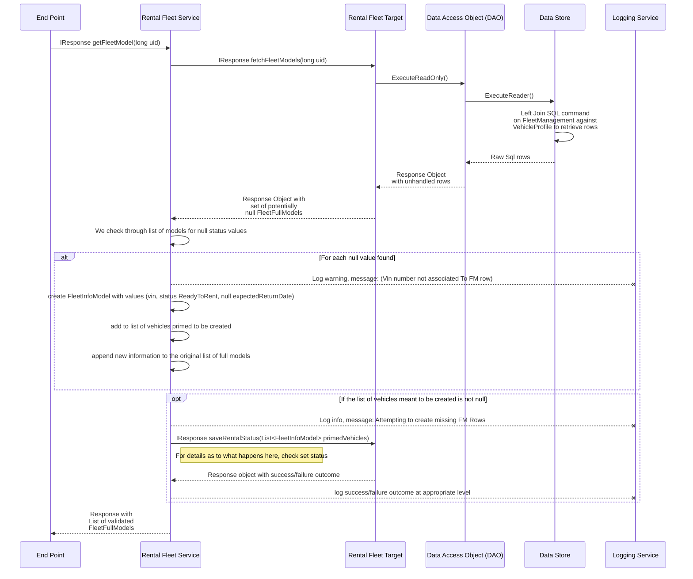
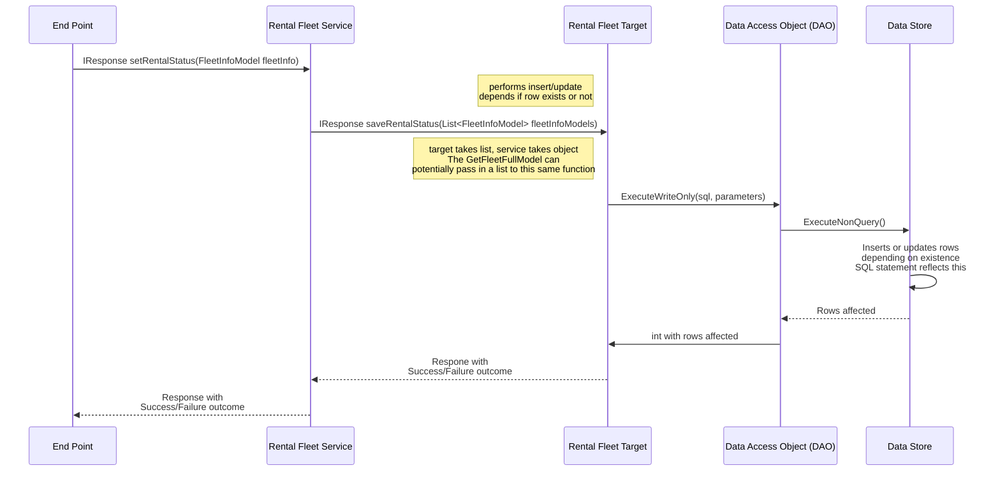

# Rental Fleet LLD
## Goal of the functionality
### User Stories:
- FM-1: As a Renter user type , I can view my entire fleet of cars to have easy access to prominent information about Vehicle Profiles and their status. 
- FM-2: As an Authenticated Renter User I can search through my fleet of vehicles that meets my filter options.

### FM-1 Requirements
1. We show the user all their vehicles and the following information
   - VIN
   - Make
   - Model
   - Color
   - (Dependent on future feature) Last Recorded Mileage
   - (Dependent on future feature) Approximate Due date of next Maintenance Event
2. Based on status, we may need to show extra details
   - Ready to rent:
     - No Additional detail
   - Out of fleet
     - Why the vehicle is out of fleet?
     - (optional) Date to return to fleet
   - Currently being rented
     - Approx date of return
3. We place vehicles into one of 3 sections based on status (also, these are the statuses)
   - Ready to rent
   - Out of fleet
   - Currently being rented

## Key classes that will be involved
- **Vehicle Profile manager**
  - This will be implemented in rainier's vehicle profile management feature
  - I will be using the manager's api to get info from the database related to the vehicle profile details
- **Rental Fleet Service**
  - handles the logic involved in the information specific to the rental fleet category
    - This incldues the dates and statuses mentioned earlier
    - Is responsible for handling the logic for retrieval and assignment
  - Note: we are not making a manager for this class, as it is mostly unneccessary. There is no real serious business logic that we have to handle, and adding in a manager layer would unneccessarily make our code base larger and harder to maintain
- **IRentalFleetTarget**
  - This is going to be the interface that defines the API for the real target that implements it
- **SQLServerRentalFleetTarget**
  - This is the target that is going to be actually implemented for our application
  - Will contain all the information necessary to translate between our DTO's and the database rows
  - Our database will store some of the information in a different format for the sake of reducing our information usage. In our database, our states will be stored as integers, and each of them will line up with the order in which they were written in the BRD (ie.. 1= Ready To rent, 2= Out of fleet, 3= Currently being rented). The Target will translate between the two for us
- **RentalFleetInfoModel**
  - This will be the DTO that we move between layers. The target creates this object when sending responses to the server
  - This will also be sent down from the service layer if we are going to update any values in our Datastore, such as the status, status info, or return date
    ```mermaid
    classDiagram
    class FleetInfoModel{
        + vin:                  string[17] <!-- vin should be 17 characters long -->
        + status:               string
        + statusInfo:           string[50]? <!-- Status info should be less than 50 char -->
        + expectedReturnDate    dateTime?
    }
    ```
- **FullFleetModel**
  - This model will contain all the details relevant to the vehicle profile
  - Can be generated by the target, and is primarily used to transmit details up the chain towards the end points
  - **Note**: The status value is not nullable in the db, but the objects are generated after a join statement that will leave it null if it doesn't exist. 
    - If the status value doesn't exist in the DB, but the vehicle does, we will handle missing values with the service layer later
    ```mermaid
    classDiagram
    class FleetFullModel{
        + vin                   string[17]
        + make                  string?[50]
        + model                 string?[50]
        + year                  int?
        + dateCreated           dateTime
        + color                 string[20]?
        + status                int?
        + statusInfo            string?[50]
        + expectedReturnDate    dateTime?
    }
    ```
- **ServiceLogInfoModel**
  - This model represents the requirements for the not yet implemented Service log and service log reminders
  - The service log is presumably where we will be storing the vehicle's mileage, as well as a reminder as to when the vehicle is next due for a maintenance event
    ```mermaid
    classDiagram
    class ServiceLogInfoModel{
      lastRecordedMileage:    int
      nextMaintenanceDueDate: dateTime
    }
    ```
## Services Layer
- This layer will ensure that we are returning valid models to the layer above, and will act as a barrier, between the higher layers and the target
- It will be designed to handle null values (that shouldn't be null) from the layer below

### Get Fleet Full Model
- The service layer function will return a full list of rental fleet models for all the user's vehicle profiles
- It will happen in a quick 2 step process
  1. First, It will request all the FleetFullModels, from the target 
     - The target will perform a left join operation, on VehicleProfile and FleetManagement, so any fleet management rows that don't exist will return null values in place of the fleet management info
  2. We will loop through the list of objects, and if we find a null value, we will create a valid (No Null values)`FleetInfoModel` model and add it to a list to keep track of it
     - We will log the VIN's of all vehicles as they come up, and record that we are going to attempt generating a row in the FleetManagement table for that vin
     - The default values when generating a fleet management row/model are: Ready To Rent + Null expectedReturnDate.
  3. 



### Set Status 
- set's the vehicles status in the datastore. Note, this does not affect the front end, it will simply change the value in the datastore. The display for the front end will be handled by the front end. 
- The target will perform an Update or an Insert, based on whether or not the row actually exists in the database or not
- actual method signature `IResponse setRentalStatus(FleetInfoModel fleetVehicleInfo)`


## Manager Layer
- We will not have a manager layer present in our application, as our projects functionality is simple enough that it is unneccessary
- The only business rules involved in the back end would be the requirements of the services themselves, so if we made a manager layer it would simply be a repeat of the services layer

## End point
- This is where we are going to check authorization, and upon successful authorization, we give the user access to the two features we are providing
  - Upon Successful authorization, they can ask for their FleetFullModels, which will be sent to the front end as a JSON formatted list of FleetFullModels.
  - Upon Successful authorization, when updating the their fleet status, we will send one JSON formatted FleetInfoModel

## Front end
### Creation of view
- The front end code will be responsible for collecting the JSON FleetFullModel's we are recieving into views
- We store all of the FleetFullModels into local storage for later retrieval
- When updating the status, it will create JSON variants of the FleetInfoModel's and send them to the endpoint in a post request
- Each vehicle profile will be displayed as a row, where we display the vehicle's
  1. Year, Make, Model
  2. Vin, Color
  3. Mileage, Maintenance Due date (pending service log implementation)
  4. Status, estimated date of return, status Message
  - **NOTE**: They will be roughly grouped according to how I just listed them
- The rows of vehicle profiles will be grouped together by Status
- The rows of vehicle profiles (within status groups) will be sorted by date of upload

### Searching
- We will have a bar above all vehicles that states `Search by []`
  - The brackets will be a drop down menu with all the user's options
    - The options will be `Make`, `Model`, `Year`, or `Status`
- When the user selects one of the previous options, they will get either an input field or a drop-down menu, and next to it there will be a button labeled `Search`
  - If they choose `Make`, `Model`, or `Year`, they will be provided with an input field, where they can type a number or word
  - If they choose `Status`, we will give them a drop down menu with each of the statuses
- When they click the `Search` button, we will search for the correct full models from the JSON version stored in Local storage, regenerate the html needed to rerender the views, clear all of the profiles from the view, then we will inject the new/freshly generated ones back into the DOM