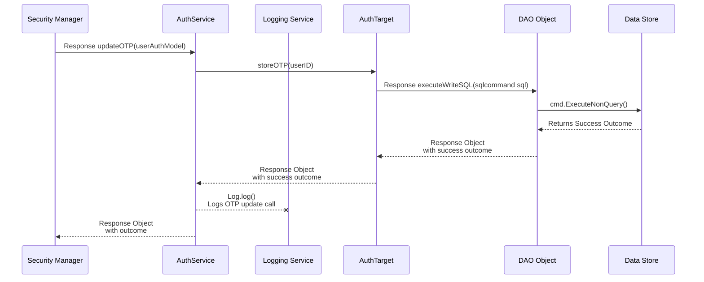
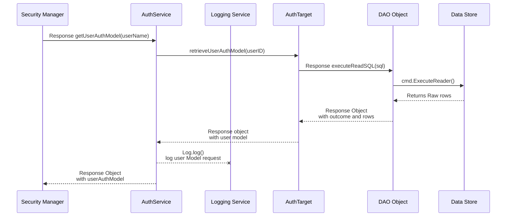
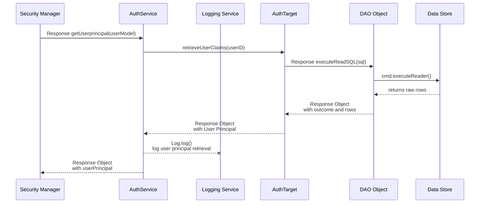
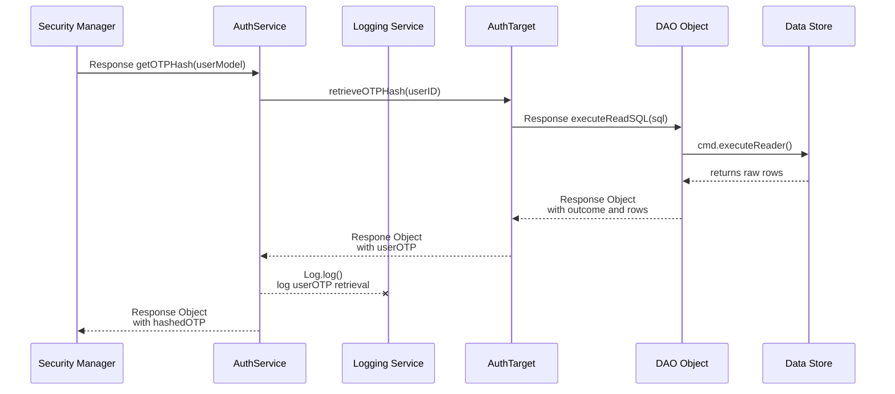
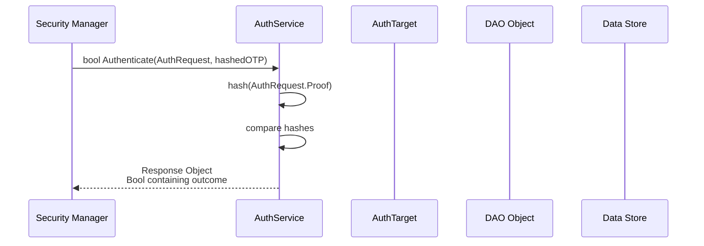
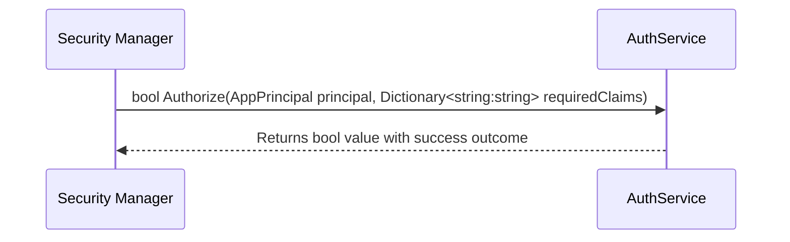
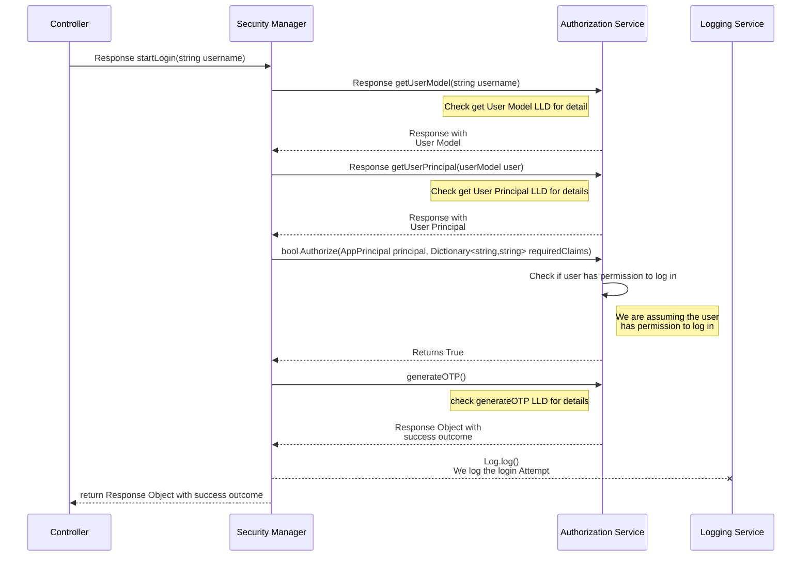
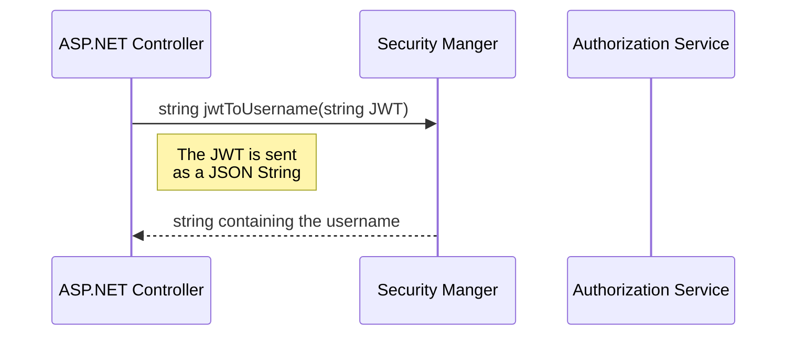

# Auth and session manager redesign
## Classes involved
- **Middleware at API endpoint**
  - This is where we add a step to immediately check the validity of the user's JWT's
  - Users will be rejected if the validity comes out as negative
  - There will be a class created to handle the middleware
w- **Controller Layer**
  - This is where we set up our Get/Post Requests that will envelop all of our manager layer functionalities
  - There will be one Post/Get request per manager layer functionality, with the exception of utility functions (any function that is meant to be used to encapsulate functionality)
- **Security Manager**
  - This is the way to access all Security Functionalities
  - It will handle all major security functionalites (such as Login, Authorization, creating JWTs, logging out) and other utility style functionalities, such as extracting information from the JWTs(for use in other functionalities)
  - We will have a copy of this class(and all its dependencies) in every API/Microservice/Endpoint
- **Auth Service**
  - This is where we create a variety of reusable functions that are controller by the Security Manager
  - The core logic of the security manager exists here, the security manager simply organizes order of execution, and ensures adherence to business rules
- **DB Auth Target**
  - Converts models to SQL and vice versa
- **AuthUserModel**
  - This is a model specifically for authorization, that contains user aspects such as their salt
- **hashedOTP**
  - This is a model that will store the user's hashedOTP when retrieved from the database
- **JWTModel**
  - This is just a model that contains all the same information 1-to-1, from the 
- **Simplified DAO functionality (for straight SQL commands)**
  - I am adjusting the currently difficult to use DAO to introduce a more streamlined approach to using it
  - We would simply pass in an SQL command object, which will then be executed
- **LoginRequest Model**
  - The loginRequest model contains the username and OTP of the user
  - This is used exclusively when logging in, and is a way to encapsulate the details contained within it
### Note: Logging
- Logging will all be done in the manager Layer
  - Because the service layer can only be accessed through this layer, it should not be necessary to log anywhere underneath
  - Also allows us to log at the start and end of each operation, as this is where all operations start

## Services Layer
### **Set OTP passcode**
- Generates and stores an OTP to the database
- Should be called upon first login attempt, so we can start with a new OTP to work with


### **Get User model**
- Returns an auth model of the current user, based on their user name


### **Get user principal**
- Returns the current User principal, regardless of their login status


### **Get User OTP**
- Retrieves the hashed OTP from the database


### **Authenticate**
- Takes in a user Authentication request, and compares it to the hashed value stored in the database
- This is ran on backend as a service, to ensure items like the pepper never end up at the front end
- Returns a boolean, stating if they match


### **Authorize**
- This is where we take in a user principal and a list of claims we are looking for
- Usage:
  - Token should be validated prior
- If every required claim is contained in the Principal AND every claim matches what it should be in the requiredClaims dictionary we are going return true
  - This means we can also check if a user has a permission set to false, such as moving from standard user to fleet user and setting the default view to false.



## Manager Layer
### Authenticate 1 - Generate OTP
- This is the step where we go to generate an OTP against their username

#### Success Case: OTP is created
#### Failure Case: The Username doesn't exist
#### Failure Case: The email is not sent
#### Failure Case: The Datastore is not available

### Authenticate 2 - Validate OTP
- This is the step where we go to validate their OTP
- Rather than simply validate the OTP, we are also going to generate a web token based on their principal.

```mermaid
sequenceDiagram
participant fe as Front End
participant ep as Controller
participant sm as Security Manager
participant as as Authorization Service
participant ls as Logging Service

fe->>ep: POST request `/Authenticate2`
ep->>sm: Response validateOTP(string username, string OTP)

sm->>as: Response getUserModel(string username)
as-->>sm: Response Object with User model

sm->>as: Response getOTPHash(authUserModel userModel)
as-->>sm: Response object with the OTP hash

sm->>as: Response getUserOTP(authUserModel userModel)
as-->>sm: Response Object with the hashed otp object

note right of sm: The loginRequest contains AuthUserModel and proof
sm->>as: Authenticate(authUserModel userModel, hashedOTP otp)
as->>as: Validates auth request to otp, ensures a match
as-->>sm: `true` bool outcome

sm->>as: Response getUserPrincipal(authUserModel)
as-->>sm: Response Object with user principal object

sm->>sm: string createIDToken(userPrincipal)
sm->>sm: string createAccessToken(userPrincipal)

.
```

### Create ID Token
- Utility function, meant to encapsulate the process of creating an ID token
- This is called in [Authenticate 2](#authenticate-2---validate-otp)

### Create Accesss Token
- Utility function, meant to encapsulate the process of creating an access token
- This is called in [Authenticate 2](#authenticate-2---validate-otp) after [Create ID Token](#create-id-token)

### Refresh User Principal
- We update their user principal to the most recent version, and regenerate their token
### Log Out
- We have the user delete their token entirely, denying them access to the system

### **Authorize**
- To be used as a Utility function
- Will not have its own dedicated end point, rather this is going to be implemented into the application by each individual functionality that needs it
- We take their JWT and the required claim, and convert that to a boolean value stating whether they are authorized for a given permission or not
- bool Authorize

### JWT to AppPrincipal
- Utility Function meant to convert from a JWT to an App Principal

### JWT to JWTModel
- Utility Function, meant to convert from a JWT in JSON String Format, to a JWTModel
- AuthModel JwtToAuthModel(json JWT)

### JWT to Username
- Utility function, meant to extract a username from a JWT


## Controller
### Login
- This is going to be a POST request
### Refresh Token
### Authenticate 1
### Authenticate 2


## Middleware
### Authenticate JWT
- This is where we will have some brief functionality to validate a JWT. We will likely call to the hashing service and pepper service to get app details to validate the hash
- This will be done with simple middleware, happens immediately after handling CORS
- Does not move layers, stays within the Program.CS file present in the Web API